# 🏛️ TaxFix - Multi-Agent German Tax Assistant

> **Intelligent multi-agent system for German tax assistance powered by LangGraph, Streamlit, and FastAPI**

<div align="center">


[Features](#features) • [Architecture](#architecture) • [Setup](#setup) • [Usage](#usage) • [Development](#development)

</div>

---

## 📋 Table of Contents

- [Overview](#overview)
- [Features](#features)
- [System Architecture](#system-architecture)
- [Tax Calculation Architecture](#-tax-calculation-architecture)
- [How the System Works](#-how-the-system-works)
- [Prerequisites](#prerequisites)
- [Installation](#installation)
- [Configuration](#configuration)
- [Database Setup](#database-setup)
- [Redis Setup](#redis-setup)
- [Running the Application](#running-the-application)
- [API Documentation](#api-documentation)
- [Development](#development)
- [Deployment](#deployment)
- [Troubleshooting](#troubleshooting)
- [Contributing](#contributing)

---

## 🌟 Overview

TaxFix is a sophisticated multi-agent system designed to provide intelligent German tax assistance. It combines the power of multiple specialized AI agents to deliver comprehensive tax advice, expense tracking, and personalized financial guidance.

### Key Highlights

- **Multi-Agent Architecture**: Specialized agents for different tax domains
- **Real-time Streaming**: Beautiful chat interface with live response streaming
- **Expense Management**: Track and categorize tax-deductible expenses
- **Profile-based Advice**: Personalized recommendations based on user profiles
- **German Tax Expertise**: Specialized knowledge of German tax law and regulations

---

## ✨ Features

### 🤖 Multi-Agent System
- **Orchestrator Agent**: Routes queries and provides general assistance
- **Action Agent**: Handles expense management and interactive actions
- **Profile Agent**: Manages user profiles and personalization
- **Tax Knowledge Agent**: Provides German tax guidance and calculations
- **Presenter Agent**: Synthesizes responses from multiple agents

### 💬 Intelligent Chat Interface
- Real-time streaming responses with markdown support
- Context-aware conversations with memory
- Smart agent routing based on user intent
- Beautiful UI with chat bubbles and proper formatting

### 📊 Comprehensive Dashboard
- Profile overview with tax status visualization
- Expense tracking and categorization
- Tax calculations and projections
- Interactive charts and analytics

### 🗃️ Data Management
- Secure user authentication and sessions
- Expense tracking with automatic categorization
- Conversation history and context persistence
- Profile-based personalization

---

## 🏗️ System Architecture

```mermaid
graph TB
    User[👤 User] --> Frontend[🖥️ Streamlit Frontend]
    Frontend --> Backend[⚡ FastAPI Backend]
    
    Backend --> Router[🎯 Agent Router]
    Router --> Workflow[🔄 LangGraph Workflow]
    
    Workflow --> Orchestrator[🎭 Orchestrator Agent]
    Workflow --> Action[⚡ Action Agent]
    Workflow --> Profile[👤 Profile Agent]
    Workflow --> TaxKnowledge[📊 Tax Knowledge Agent]
    
    %% All agent outputs flow to Presenter for synthesis
    Orchestrator --> Presenter[🎨 Presenter Agent]
    Action --> Presenter
    Profile --> Presenter
    TaxKnowledge --> Presenter
    
    %% Presenter synthesizes and returns final response
    Presenter --> Backend
    Backend --> Frontend
    Frontend --> User
    
    %% External services
    Backend --> Database[(🗄️ Supabase)]
    Backend --> Redis[(🔴 Redis Cache)]
    Backend --> LLM[🧠 Groq LLM]
    
    %% Agent-specific tools and services
    Action --> ExpenseTools[💰 Expense Tools]
    Profile --> ProfileNormalizer[📝 Profile Normalizer]
    TaxKnowledge --> TaxCalculator[🧮 Tax Calculator]
    TaxKnowledge --> TaxSearchEngine[🔍 Tax Search Engine]
    TaxKnowledge --> TaxDataLoader[📊 Tax Data Loader]
```



### Agent Responsibilities

| Agent | Purpose | Key Functions |
|-------|---------|---------------|
| **Orchestrator** | General queries & routing fallback | Greetings, general tax questions |
| **Action** | Expense management & actions | Add/view/delete expenses, suggestions |
| **Profile** | User profile management | Update profile, extract personal info |
| **Tax Knowledge** | German tax expertise | Tax calculations, deductions, regulations |
| **Presenter** | Response synthesis | Combine agent outputs into cohesive responses |

### 🧮 Tax Calculation Architecture

TaxFix uses a **hybrid approach** that combines LLMs for natural language understanding with **deterministic, rule-based calculations** for mathematical accuracy.

#### 🎯 **Why This Architecture?**

**The Problem with LLM-Only Calculations:**
- **Hallucination Risk**: LLMs can generate incorrect numbers or formulas
- **Performance**: LLM calls are slower and more expensive for calculations
- **Inconsistency**: Same inputs might produce different outputs

**Our Solution:**
- **LLMs for Understanding**: Natural language processing and user intent
- **Deterministic Engines for Math**: Hardcoded formulas and tax rules
- **Best of Both Worlds**: AI flexibility + mathematical precision

#### 🏗️ **Architecture Components**

- **🧠 LLM Services**: Handle natural language, user intent, and response formatting
- **🧮 Math Services**: Perform pure mathematical calculations using 2024 German tax rules
- **🔄 Hybrid Flow**: LLMs understand queries → Math engines calculate → LLMs format responses

#### 📊 **What Gets Calculated Deterministically**

- Income tax calculations (Einkommensteuer)
- Solidarity surcharge and church tax
- Social security contributions
- Tax brackets and marginal rates
- Deduction analysis and tax optimization

#### ⚠️ **Important Disclaimer**

**This is a prototype system** designed for demonstration purposes. While the mathematical formulas and tax brackets are based on official German tax law for 2024, the calculated amounts may not be 100% accurate for real-world tax filing.

---

## 🔄 How the System Works

TaxFix processes user queries through a multi-agent workflow that combines specialized AI agents with deterministic tax calculations.

### 🎯 **Simple Workflow**

1. **User Input** → Frontend captures message
2. **Agent Routing** → System determines which agents to activate
3. **Parallel Processing** → Relevant agents work simultaneously
4. **Response Synthesis** → Presenter Agent combines all outputs
5. **Response Delivery** → Stream response back to user

### 🧠 **Agent Roles**

- **🎭 Orchestrator**: Handles greetings and general queries
- **⚡ Action**: Manages expenses and interactive tasks
- **👤 Profile**: Extracts and updates user information
- **📊 Tax Knowledge**: Performs calculations and provides tax guidance
- **🎨 Presenter**: Synthesizes all agent outputs into cohesive responses

### 🔄 **Key Features**

- **Smart Routing**: Rule-based and LLM-powered agent selection
- **Context Awareness**: Remembers conversations and user profiles
- **Parallel Processing**: Multiple agents work simultaneously for faster responses
- **Error Handling**: Fallback mechanisms ensure reliable responses
- **Streaming**: Real-time response delivery to users

---

Before installing TaxFix, ensure you have the following installed:

### System Requirements
- **Python 3.11+** (Required for modern async features)
- **Redis Server** (For caching and session management)
- **Git** (For cloning the repository)

### External Services
- **Supabase Account** (Database hosting)
- **Groq API Key** (LLM provider)
- **LangSmith Account** (Optional: For tracing and monitoring)

---

## 🚀 Installation

### 1. Clone the Repository

```bash
git clone https://github.com/your-username/taxfix.git
cd taxfix
```

### 2. Create Python Virtual Environment

```bash
# Create virtual environment
python3.11 -m venv venv

# Activate virtual environment
# On macOS/Linux:
source venv/bin/activate

# On Windows:
# venv\Scripts\activate
```

### 3. Install Dependencies

```bash
pip install --upgrade pip
pip install -r requirements.txt
```

---

## ⚙️ Configuration

### 1. Environment Variables

Copy the example environment file and configure it:

```bash
cp config/env.example .env
```

Edit the `.env` file with your actual values:

```bash
# LLM API Keys
GROQ_API_KEY=your_groq_api_key_here
LANGCHAIN_API_KEY=your_langchain_api_key_here
LANGCHAIN_TRACING_V2=true
LANGCHAIN_PROJECT=TaxFix-MultiAgent

# Database Configuration
SUPABASE_URL=your_supabase_url_here
SUPABASE_KEY=your_supabase_anon_key_here
SUPABASE_SERVICE_KEY=your_supabase_service_key_here

# Redis Configuration
REDIS_URL=redis://localhost:6379
REDIS_PASSWORD=your_redis_password_here

# Application Configuration
APP_NAME=TaxFix Multi-Agent System
DEBUG=True
LOG_LEVEL=INFO

# Security
SECRET_KEY=your_secure_secret_key_here
JWT_SECRET=your_jwt_secret_here
```

### 2. API Keys Setup

#### Groq API Key
1. Visit [Groq Console](https://console.groq.com/)
2. Create an account or sign in
3. Generate an API key
4. Add it to your `.env` file

#### LangSmith (Optional but Recommended)
1. Visit [LangSmith](https://smith.langchain.com/)
2. Create an account
3. Generate an API key
4. Add it to your `.env` file

---

## 🗄️ Database Setup

### 1. Supabase Setup

1. **Create Supabase Project**:
   - Go to [Supabase](https://supabase.com/)
   - Create a new project
   - Note your project URL and API keys

2. **Run Database Schema**:
   ```bash
   # Copy the SQL schema to Supabase SQL editor and execute
   cat supabase_schema_minimal.sql
   ```

3. **Configure Environment**:
   ```bash
   SUPABASE_URL=https://your-project.supabase.co
   SUPABASE_KEY=your_anon_key
   SUPABASE_SERVICE_KEY=your_service_key
   ```

### Database Schema Overview

The system uses the following core tables:
- **users**: User authentication and basic info
- **user_profiles**: Detailed user profiles for tax personalization
- **conversations**: Chat conversation metadata
- **messages**: Individual chat messages
- **tax_documents**: Expense tracking and tax documents

---

## 🔴 Redis Setup

Redis is crucial for session management, caching, and real-time features.

### Local Redis Installation

#### macOS (using Homebrew)
```bash
# Install Redis
brew install redis

# Start Redis service
brew services start redis

# Test Redis connection
redis-cli ping
# Should return: PONG
```

#### Ubuntu/Debian
```bash
# Install Redis
sudo apt update
sudo apt install redis-server

# Start Redis service
sudo systemctl start redis-server
sudo systemctl enable redis-server

# Test Redis connection
redis-cli ping
# Should return: PONG
```

#### Docker (Alternative)
```bash
# Run Redis in Docker
docker run -d --name redis -p 6379:6379 redis:7-alpine

# Test connection
docker exec -it redis redis-cli ping
```

### Redis Configuration

Update your `.env` file:
```bash
REDIS_URL=redis://localhost:6379
REDIS_PASSWORD=your_password_here  # Optional
```

### Why Redis is Essential

- **Session Management**: Stores user authentication sessions
- **Conversation Caching**: Caches conversation history for fast retrieval
- **Agent State**: Maintains agent state between requests
- **Rate Limiting**: Implements API rate limiting
- **Background Tasks**: Queues background processing tasks

---

## 🎯 Running the Application

### Development Mode

#### Method 1: Using Scripts (Recommended)

```bash
# Start backend (FastAPI)
python scripts/start_backend.py

# In another terminal, start frontend (Streamlit)
python scripts/start_frontend.py
```

#### Method 2: Manual Start

```bash
# Terminal 1: Start Backend
cd apps/backend
uvicorn main:app --host 0.0.0.0 --port 8000 --reload

# Terminal 2: Start Frontend
cd apps/frontend
streamlit run main.py --server.address 0.0.0.0 --server.port 8501
```

#### Method 3: Using Makefile

```bash
# Start both services
make run

# Or individually
make backend
make frontend
```

### Accessing the Application

- **Frontend (Streamlit)**: http://localhost:8501
- **Backend API**: http://localhost:8000
- **API Documentation**: http://localhost:8000/docs

### First Run Setup

1. **Create User Account**: Register through the frontend interface
2. **Set Up Profile**: Complete your tax profile for personalized advice
3. **Test Chat**: Ask a tax question to verify the system is working
4. **Add Expenses**: Try adding some expenses to test expense tracking

---

## 📚 API Documentation

The FastAPI backend provides comprehensive API documentation:

### Core Endpoints

| Endpoint | Method | Description |
|----------|--------|-------------|
| `/auth/register` | POST | User registration |
| `/auth/login` | POST | User authentication |
| `/auth/me` | GET | Get current user info |
| `/chat/message` | POST | Send chat message |
| `/chat/message/stream` | POST | Send chat message (streaming) |
| `/user/profile` | GET/POST | User profile management |
| `/user/expenses` | GET | Get user expenses |
| `/user/dashboard-data` | GET | Dashboard analytics |

### Interactive Documentation

Visit http://localhost:8000/docs for interactive API documentation with:
- Request/response schemas
- Try-it-out functionality
- Authentication examples
- Error code explanations

---

## 🛠️ Development

### Project Structure

```
taxfix/
├── 📁 apps/                    # Application layers
│   ├── 📁 backend/             # FastAPI backend
│   │   ├── 📁 routers/         # API route handlers
│   │   ├── main.py             # FastAPI app entry point
│   │   ├── dependencies.py     # Service dependencies
│   │   └── models.py           # API models
│   └── 📁 frontend/            # Streamlit frontend
│       ├── 📁 auth/            # Authentication components
│       ├── 📁 components/      # UI components
│       ├── 📁 services/        # Frontend services
│       ├── 📁 utils/           # Frontend utilities
│       └── main.py             # Streamlit app entry point
├── 📁 src/                     # Core system components
│   ├── 📁 agents/              # Multi-agent system
│   │   ├── action_agent.py     # Expense & action management
│   │   ├── orchestrator.py     # Workflow coordination
│   │   ├── presenter.py        # Response synthesis
│   │   ├── profile.py          # User profile management
│   │   └── tax_knowledge.py    # Tax expertise
│   ├── 📁 services/            # Business logic services
│   │   ├── 📁 tax/             # Tax calculation services
│   │   ├── auth.py             # Authentication service
│   │   ├── database.py         # Database operations
│   │   ├── llm.py              # LLM integration
│   │   └── memory.py           # Redis memory service
│   ├── 📁 tools/               # Agent tools and utilities
│   ├── 📁 workflow/            # LangGraph workflow
│   ├── 📁 core/                # Core system utilities
│   ├── 📁 models/              # Data models
│   ├── 📁 utils/               # Utility functions
│   └── 📁 data/                # Static data files
├── 📁 config/                  # Configuration files
├── 📁 scripts/                 # Utility scripts
├── 📁 docs/                    # Documentation
├── docker-compose.yml          # Docker orchestration
├── requirements.txt            # Python dependencies
└── supabase_schema.sql         # Database schema
```

### Code Quality

```bash
# Install development dependencies
pip install black flake8 pytest

# Format code
black .

# Lint code
flake8 .

# Run tests
pytest
```

### Adding New Agents

1. **Create Agent Class**:
   ```python
   # src/agents/my_agent.py
   from .base import BaseAgent
   from ..core.state import AgentType
   
   class MyAgent(BaseAgent):
       def __init__(self, *args, **kwargs):
           super().__init__(AgentType.MY_AGENT, *args, **kwargs)
   
       async def process(self, message, context, session_id, user_profile=None):
           # Your agent logic here
           pass
   ```

2. **Register in Workflow**:
   ```python
   # src/workflow/graph.py
   # Add your agent to the workflow
   ```

3. **Update Router**:
   ```python
   # src/services/agent_router.py
   # Add routing logic for your agent
   ```

### Environment-Specific Configuration

#### Development
```bash
DEBUG=True
LOG_LEVEL=DEBUG
```

#### Production
```bash
DEBUG=False
LOG_LEVEL=INFO
REDIS_URL=redis://production-redis:6379
```

---

## 🚀 Deployment

### Production Deployment

#### Using Docker

1. **Build Images**:
   ```bash
   # Backend
   docker build -t taxfix-backend -f apps/backend/Dockerfile .
   
   # Frontend
   docker build -t taxfix-frontend -f apps/frontend/Dockerfile .
   ```

2. **Run with Docker Compose**:
   ```bash
   docker-compose up -d
   ```

#### Environment Variables for Production

```bash
# Production environment
DEBUG=False
LOG_LEVEL=INFO

# Use production Redis
REDIS_URL=redis://your-redis-server:6379

# Production Supabase
SUPABASE_URL=https://your-prod-project.supabase.co

# Secure secrets
SECRET_KEY=your-very-secure-secret-key
JWT_SECRET=your-jwt-secret-key
```

### Scaling Considerations

- **Redis Clustering**: For high availability
- **Load Balancing**: Multiple backend instances
- **Database Optimization**: Connection pooling
- **Caching Strategy**: Redis for frequently accessed data

---

## 🔧 Troubleshooting

### Common Issues

#### 1. Redis Connection Errors
```bash
# Check if Redis is running
redis-cli ping

# Start Redis if not running
brew services start redis  # macOS
sudo systemctl start redis-server  # Linux
```

#### 2. Database Connection Issues
- Verify Supabase URL and keys in `.env`
- Check network connectivity to Supabase
- Ensure database schema is properly created

#### 3. API Key Errors
- Verify Groq API key is valid and has credits
- Check LangSmith API key if using tracing
- Ensure API keys are properly set in `.env`

#### 4. Frontend Not Loading
```bash
# Check if backend is running
curl http://localhost:8000/health

# Restart frontend
streamlit run apps/frontend/main.py --server.port 8501
```

#### 5. Streaming Not Working
- Ensure browser supports Server-Sent Events (SSE)
- Check network proxy settings
- Verify CORS configuration in backend

### Debug Mode

Enable detailed logging:
```bash
DEBUG=True
LOG_LEVEL=DEBUG
```

### Health Checks

```bash
# Backend health
curl http://localhost:8000/health

# Redis connectivity
redis-cli ping

# Database connectivity
# Check Supabase dashboard
```

---


## 📄 License

This project is licensed under the MIT License. See [LICENSE](LICENSE) file for details.

---

## 🙏 Acknowledgments

- **LangGraph**: For the multi-agent framework
- **Streamlit**: For the beautiful frontend framework
- **FastAPI**: For the high-performance backend
- **Supabase**: For the database and authentication
- **Groq**: For fast LLM inference


---

<div align="center">

**Built with ❤️ for TaxFix Assessment**

[⬆ Back to top](#-taxfix---multi-agent-german-tax-assistant)

</div>
