# 🏛️ TaxFix - Multi-Agent German Tax Assistant

> **Intelligent multi-agent system for German tax assistance powered by LangGraph, Streamlit, and FastAPI**

<div align="center">


[Features](#features) • [Architecture](#architecture) • [Setup](#setup) • [Usage](#usage) • [Development](#development)

</div>

---

## 📋 Table of Contents

- [Overview](#overview)
- [Features](#features)
- [System Architecture](#system-architecture)
- [Tax Calculation Architecture](#-tax-calculation-architecture)
- [How the System Works](#-how-the-system-works)
- [Prerequisites](#prerequisites)
- [Installation](#installation)
- [Configuration](#configuration)
- [Database Setup](#database-setup)
- [Redis Setup](#redis-setup)
- [Running the Application](#running-the-application)
- [API Documentation](#api-documentation)
- [Development](#development)
- [Deployment](#deployment)
- [Troubleshooting](#troubleshooting)
- [Contributing](#contributing)

---

## 🌟 Overview

TaxFix is a sophisticated multi-agent system designed to provide intelligent German tax assistance. It combines the power of multiple specialized AI agents to deliver comprehensive tax advice, expense tracking, and personalized financial guidance.

### Key Highlights

- **Multi-Agent Architecture**: Specialized agents for different tax domains
- **Real-time Streaming**: Beautiful chat interface with live response streaming
- **Expense Management**: Track and categorize tax-deductible expenses
- **Profile-based Advice**: Personalized recommendations based on user profiles
- **German Tax Expertise**: Specialized knowledge of German tax law and regulations

---

## ✨ Features

### 🤖 Multi-Agent System
- **Orchestrator Agent**: Routes queries and provides general assistance
- **Action Agent**: Handles expense management and interactive actions
- **Profile Agent**: Manages user profiles and personalization
- **Tax Knowledge Agent**: Provides German tax guidance and calculations
- **Presenter Agent**: Synthesizes responses from multiple agents

### 💬 Intelligent Chat Interface
- Real-time streaming responses with markdown support
- Context-aware conversations with memory
- Smart agent routing based on user intent
- Beautiful UI with chat bubbles and proper formatting

### 📊 Comprehensive Dashboard
- Profile overview with tax status visualization
- Expense tracking and categorization
- Tax calculations and projections
- Interactive charts and analytics

### 🗃️ Data Management
- Secure user authentication and sessions
- Expense tracking with automatic categorization
- Conversation history and context persistence
- Profile-based personalization

---

## 🏗️ System Architecture

```mermaid
graph TB
    User[👤 User] --> Frontend[🖥️ Streamlit Frontend]
    Frontend --> Backend[⚡ FastAPI Backend]
    
    Backend --> Router[🎯 Agent Router]
    Router --> Workflow[🔄 LangGraph Workflow]
    
    Workflow --> Orchestrator[🎭 Orchestrator Agent]
    Workflow --> Action[⚡ Action Agent]
    Workflow --> Profile[👤 Profile Agent]
    Workflow --> TaxKnowledge[📊 Tax Knowledge Agent]
    
    %% All agent outputs flow to Presenter for synthesis
    Orchestrator --> Presenter[🎨 Presenter Agent]
    Action --> Presenter
    Profile --> Presenter
    TaxKnowledge --> Presenter
    
    %% Presenter synthesizes and returns final response
    Presenter --> Backend
    Backend --> Frontend
    Frontend --> User
    
    %% External services
    Backend --> Database[(🗄️ Supabase)]
    Backend --> Redis[(🔴 Redis Cache)]
    Backend --> LLM[🧠 Groq LLM]
    
    %% Agent-specific tools and services
    Action --> ExpenseTools[💰 Expense Tools]
    Profile --> ProfileNormalizer[📝 Profile Normalizer]
    TaxKnowledge --> TaxCalculator[🧮 Tax Calculator]
    TaxKnowledge --> TaxSearchEngine[🔍 Tax Search Engine]
    TaxKnowledge --> TaxDataLoader[📊 Tax Data Loader]
```



### Agent Responsibilities

| Agent | Purpose | Key Functions |
|-------|---------|---------------|
| **Orchestrator** | General queries & routing fallback | Greetings, general tax questions |
| **Action** | Expense management & actions | Add/view/delete expenses, suggestions |
| **Profile** | User profile management | Update profile, extract personal info |
| **Tax Knowledge** | German tax expertise | Tax calculations, deductions, regulations |
| **Presenter** | Response synthesis | Combine agent outputs into cohesive responses |

### 🧮 Tax Calculation Architecture

TaxFix implements a sophisticated, **mathematically-precise** tax calculation system that separates **deterministic calculations** from **intelligent analysis** to ensure accuracy and prevent LLM hallucination in critical tax computations.

#### 🎯 **Core Design Philosophy**

**Mathematical Certainty First**: All tax calculations use hardcoded German tax rules and formulas, ensuring 100% accuracy without LLM involvement.

**Intelligent Analysis Second**: LLMs are only used for relevance scoring and user intent understanding, never for mathematical calculations.

#### 🏗️ **Specialized Tax Services**

The Tax Knowledge Agent orchestrates four specialized services, each with a single responsibility:

##### 1. **TaxCalculationEngine** - Pure Mathematical Logic
```python
# Hardcoded 2024 German tax constants (NO LLM)
GRUNDFREIBETRAG = 11604  # Basic allowance
WERBUNGSKOSTEN_PAUSCHALE = 1230  # Work expense allowance
TAX_BRACKETS = [
    {"min": 0, "max": 11604, "rate": 0.0},           # Tax-free
    {"min": 11604, "max": 17005, "rate": 0.14},     # Entry rate
    {"min": 17005, "max": 66760, "rate": 0.24},     # Progressive zone 1
    {"min": 66760, "max": 277825, "rate": 0.42},    # Main zone
    {"min": 277825, "max": float("inf"), "rate": 0.45}  # Top rate
]
```

**Responsibilities:**
- ✅ **German income tax calculations** using 2024 tax brackets
- ✅ **Social security contributions** (health, pension, unemployment, long-term care)
- ✅ **Progressive tax calculations** with exact mathematical formulas
- ✅ **Tax optimization scenarios** (different filing statuses, dependents)
- ✅ **Deduction impact calculations** (tax savings from deductions)

**Why This is Safe:** 100% deterministic calculations = No hallucination risk.

##### 2. **TaxSearchEngine** - Pure Algorithmic Search
```python
def score_rule_relevance(self, rule: TaxRule, query_lower: str) -> float:
    score = 0.0
    # Keyword matching algorithms (NO LLM)
    if any(word in rule.name.lower() for word in query_lower.split()):
        score += 0.8
    # Category and profile-based scoring
    return score
```

**Responsibilities:**
- ✅ **Keyword-based search** across tax rules and deductions
- ✅ **Relevance scoring** using text matching algorithms
- ✅ **Profile-aware ranking** (boosts results based on user profile)
- ✅ **Result filtering** and top-N selection

**Why This is Safe:** Pure algorithmic search = No hallucination risk.

##### 3. **TaxDataLoader** - Pure Data Management
```python
def load_tax_data(self) -> None:
    # Load static tax data (NO LLM)
    self.tax_rules = get_german_tax_rules() or []
    self.deductions = self.normalize_deductions(source_deductions)
```

**Responsibilities:**
- ✅ **Loads tax data** from static data sources
- ✅ **Normalizes and validates** tax rule and deduction data
- ✅ **Provides cached access** to tax information
- ✅ **Data structure management** (no AI involved)

**Why This is Safe:** Pure data management = No hallucination risk.

##### 4. **TaxDeductionAnalyzer** - Hybrid (LLM + Logic)
```python
def __init__(self, tax_service, llm_service):
    self.tax_service = tax_service
    self.llm_service = llm_service  # Only for relevance scoring
```

**Responsibilities:**
- ✅ **Rule-based scoring** for deduction relevance (no LLM)
- ✅ **Profile compatibility scoring** (no LLM)
- ⚠️ **LLM-based scoring** for complex relevance analysis (minimal LLM usage)
- ✅ **Final ranking and filtering** (no LLM)

**LLM Usage:** Only for **intelligent relevance scoring** when rule-based scoring isn't sufficient.

#### 🛡️ **Safety & Accuracy Measures**

| Component | LLM Usage | Risk Level | Accuracy |
|-----------|-----------|------------|----------|
| **Tax Calculations** | ❌ None | 🟢 Zero | 100% Deterministic |
| **Tax Data Loading** | ❌ None | 🟢 Zero | 100% Deterministic |
| **Tax Search** | ❌ None | 🟢 Zero | 100% Deterministic |
| **Deduction Analysis** | ⚠️ Minimal | 🟡 Low | 95%+ Deterministic |

#### 📊 **Calculation Capabilities**

**German Tax Calculations (2024 Rules):**
- **Income Tax**: Progressive tax brackets with exact rates
- **Basic Allowance**: Grundfreibetrag (€11,604 for singles, €23,208 for married couples)
- **Work Expenses**: Werbungskosten (€1,230 standard deduction)
- **Child Allowances**: Kinderfreibetrag calculations
- **Social Security**: Health insurance, pension, unemployment, long-term care
- **Additional Taxes**: Solidarity surcharge (5.5%), Church tax (8-9%)

**Tax Optimization Scenarios:**
- Different filing statuses (single, married jointly/separately)
- Dependent children impact calculations
- Deduction vs. standard deduction comparisons
- Tax savings from specific deductions

#### ⚠️ **Important Disclaimer**

**This is a prototype system** designed for demonstration purposes. While the mathematical formulas and tax brackets are based on official German tax law for 2024, the calculated amounts may not be 100% accurate for real-world tax filing.

---

## 🔄 How the System Works

TaxFix operates as an intelligent multi-agent system that processes user queries through a sophisticated workflow, combining specialized AI agents with deterministic tax calculations to provide accurate, personalized German tax assistance.

### 🎯 **System Workflow Overview**

```mermaid
sequenceDiagram
    participant U as 👤 User
    participant F as 🖥️ Frontend
    participant B as ⚡ Backend
    participant R as 🎯 Agent Router
    participant W as 🔄 LangGraph Workflow
    participant O as 🎭 Orchestrator
    participant A as ⚡ Action Agent
    participant P as 👤 Profile Agent
    participant T as 📊 Tax Knowledge Agent
    participant Pr as 🎨 Presenter Agent
    participant DB as 🗄️ Database
    participant Redis as 🔴 Redis Cache

    U->>F: User sends message
    F->>B: HTTP request to /chat/message
    B->>R: Route query to appropriate agents
    R->>W: Initialize LangGraph workflow
    
    W->>O: Process with Orchestrator Agent
    O->>DB: Load user profile & context
    O->>Redis: Check conversation history
    
    W->>A: Process with Action Agent
    A->>DB: Check for expense actions
    A->>Redis: Update expense tracking
    
    W->>P: Process with Profile Agent
    P->>DB: Extract/update user profile
    P->>Redis: Store profile updates
    
    W->>T: Process with Tax Knowledge Agent
    T->>DB: Load tax rules & deductions
    T->>T: Calculate taxes (deterministic)
    T->>T: Search relevant deductions
    
    W->>Pr: Synthesize all agent outputs
    Pr->>Pr: Generate cohesive response
    Pr->>W: Return synthesized response
    
    W->>B: Final response
    B->>DB: Store conversation
    B->>Redis: Update session cache
    B->>F: Stream response to frontend
    F->>U: Display response to user
```



### 🧠 **Agent Processing Pipeline**

#### **1. 🎯 Agent Router & Query Analysis**
```python
# The system first analyzes the user's intent
query_analysis = {
    "intent": "tax_calculation",  # or "expense_management", "profile_update", etc.
    "complexity": "medium",
    "requires_profile": True,
    "requires_calculation": True
}
```

**What happens:**
- **Intent Detection**: Determines if query is about taxes, expenses, profile, or general
- **Complexity Assessment**: Evaluates if simple greeting or complex tax question
- **Resource Requirements**: Identifies which agents and data are needed
- **Routing Decision**: Selects appropriate agent(s) to process the query

#### **2. 🎭 Orchestrator Agent - The Coordinator**
```python
# Orchestrator handles general queries and coordinates the workflow
if is_simple_greeting(user_message):
    return create_greeting_response()
else:
    return create_general_response(user_message, context)
```

**Responsibilities:**
- **Greeting Detection**: Identifies simple greetings and provides welcome responses
- **General Tax Questions**: Handles broad tax-related queries
- **Workflow Coordination**: Manages the overall conversation flow
- **Context Management**: Maintains conversation context and user state

#### **3. ⚡ Action Agent - The Doer**
```python
# Action Agent handles interactive tasks and expense management
if "add expense" in user_message:
    return handle_add_expense(user_message, profile)
elif "suggest expense" in user_message:
    return handle_suggest_expense(user_message, profile)
else:
    return handle_general_guidance(user_message, profile)
```

**Responsibilities:**
- **Expense Management**: Add, view, delete, and categorize expenses
- **Interactive Actions**: Handle user commands and requests
- **Expense Suggestions**: Proactively suggest deductible expenses
- **Action Validation**: Ensure actions are valid and properly formatted

#### **4. 👤 Profile Agent - The Personalizer**
```python
# Profile Agent extracts and manages user information
if "update profile" in user_message:
    return handle_profile_update_request(user_message, current_profile)
elif "create profile" in user_message:
    return handle_profile_creation_request(user_message)
else:
    return handle_passive_profile_update(user_message, current_profile)
```

**Responsibilities:**
- **Profile Extraction**: Automatically extract personal info from conversations
- **Profile Updates**: Update user profiles based on new information
- **Personalization**: Use profile data to customize responses
- **Data Validation**: Ensure profile data is accurate and complete

#### **5. 📊 Tax Knowledge Agent - The Expert**
```python
# Tax Knowledge Agent provides specialized tax guidance
relevant_rules = tax_service.search_tax_rules(user_message)
relevant_deductions = tax_service.search_deductions(user_message)
calculations = calculator.perform_calculations(user_message, user_profile)
```

**Responsibilities:**
- **Tax Calculations**: Perform precise German tax calculations using 2024 rules
- **Deduction Analysis**: Identify relevant deductions for the user
- **Tax Rule Search**: Find applicable tax rules and regulations
- **Personalized Advice**: Provide advice based on user's specific situation

#### **6. 🎨 Presenter Agent - The Synthesizer**
```python
# Presenter Agent combines all agent outputs into a cohesive response
synthesized_response = synthesize_responses(
    orchestrator_output=orchestrator_response,
    action_output=action_response,
    profile_output=profile_response,
    tax_output=tax_response,
    user_message=user_message,
    conversation_history=history
)
```

**Responsibilities:**
- **Response Synthesis**: Combine multiple agent outputs into one coherent response
- **Intelligence Filtering**: Remove redundant or conflicting information
- **Tone Consistency**: Ensure responses match the user's complexity level
- **Context Awareness**: Maintain conversation flow and context

### 🔄 **Data Flow & State Management**

#### **Request Processing Flow:**
1. **User Input** → Frontend captures user message
2. **Authentication** → Backend validates user session
3. **Context Loading** → Load user profile and conversation history
4. **Agent Routing** → Determine which agents to activate
5. **Parallel Processing** → Run relevant agents simultaneously
6. **Response Synthesis** → Presenter Agent combines outputs
7. **Response Delivery** → Stream response back to user
8. **State Update** → Update database and cache with new information

#### **State Management:**
```python
# System maintains state across multiple dimensions
system_state = {
    "user_session": {
        "user_id": "user_123",
        "session_id": "session_456",
        "authenticated": True
    },
    "conversation_context": {
        "conversation_id": "conv_789",
        "message_history": [...],
        "current_topic": "tax_calculation"
    },
    "user_profile": {
        "income": 50000,
        "filing_status": "single",
        "dependents": 0,
        "employment_status": "employed"
    },
    "expense_tracking": {
        "pending_expenses": [...],
        "categorized_expenses": {...}
    }
}
```

### 🎯 **Intelligent Features**

#### **Smart Agent Selection:**
- **Rule-based Routing**: Simple queries go to specific agents
- **LLM-powered Routing**: Complex queries use AI to determine best agents
- **Parallel Processing**: Multiple agents can work simultaneously
- **Fallback Mechanisms**: Always have a response even if agents fail

#### **Context Awareness:**
- **Conversation Memory**: Remembers previous messages and context
- **Profile Integration**: Uses user profile to personalize responses
- **Session Persistence**: Maintains state across multiple interactions
- **Learning**: Adapts responses based on user feedback

#### **Response Optimization:**
- **Complexity Matching**: Adjusts response detail to match user's question
- **Streaming Responses**: Provides real-time feedback to users
- **Error Handling**: Graceful degradation when services are unavailable
- **Caching**: Reduces response time for common queries

### 🛡️ **Reliability & Safety**

#### **Error Handling:**
```python
# Each agent has fallback mechanisms
try:
    response = await agent.process(message, context)
except Exception as e:
    logger.error(f"Agent {agent.name} failed: {e}")
    response = agent.get_fallback_response()
```

#### **Data Validation:**
- **Input Sanitization**: All user inputs are validated and sanitized
- **Profile Validation**: User profile data is checked for consistency
- **Tax Calculation Verification**: Mathematical results are validated
- **Response Quality**: All responses are checked before delivery

#### **Performance Optimization:**
- **Async Processing**: All operations are non-blocking
- **Caching Strategy**: Frequently accessed data is cached
- **Database Optimization**: Efficient queries and indexing
- **Resource Management**: Proper cleanup and memory management

This architecture ensures that TaxFix provides accurate, personalized, and reliable German tax assistance while maintaining high performance and user experience.

---

Before installing TaxFix, ensure you have the following installed:

### System Requirements
- **Python 3.11+** (Required for modern async features)
- **Redis Server** (For caching and session management)
- **Git** (For cloning the repository)

### External Services
- **Supabase Account** (Database hosting)
- **Groq API Key** (LLM provider)
- **LangSmith Account** (Optional: For tracing and monitoring)

---

## 🚀 Installation

### 1. Clone the Repository

```bash
git clone https://github.com/your-username/taxfix.git
cd taxfix
```

### 2. Create Python Virtual Environment

```bash
# Create virtual environment
python3.11 -m venv venv

# Activate virtual environment
# On macOS/Linux:
source venv/bin/activate

# On Windows:
# venv\Scripts\activate
```

### 3. Install Dependencies

```bash
pip install --upgrade pip
pip install -r requirements.txt
```

---

## ⚙️ Configuration

### 1. Environment Variables

Copy the example environment file and configure it:

```bash
cp config/env.example .env
```

Edit the `.env` file with your actual values:

```bash
# LLM API Keys
GROQ_API_KEY=your_groq_api_key_here
LANGCHAIN_API_KEY=your_langchain_api_key_here
LANGCHAIN_TRACING_V2=true
LANGCHAIN_PROJECT=TaxFix-MultiAgent

# Database Configuration
SUPABASE_URL=your_supabase_url_here
SUPABASE_KEY=your_supabase_anon_key_here
SUPABASE_SERVICE_KEY=your_supabase_service_key_here

# Redis Configuration
REDIS_URL=redis://localhost:6379
REDIS_PASSWORD=your_redis_password_here

# Application Configuration
APP_NAME=TaxFix Multi-Agent System
DEBUG=True
LOG_LEVEL=INFO

# Security
SECRET_KEY=your_secure_secret_key_here
JWT_SECRET=your_jwt_secret_here
```

### 2. API Keys Setup

#### Groq API Key
1. Visit [Groq Console](https://console.groq.com/)
2. Create an account or sign in
3. Generate an API key
4. Add it to your `.env` file

#### LangSmith (Optional but Recommended)
1. Visit [LangSmith](https://smith.langchain.com/)
2. Create an account
3. Generate an API key
4. Add it to your `.env` file

---

## 🗄️ Database Setup

### 1. Supabase Setup

1. **Create Supabase Project**:
   - Go to [Supabase](https://supabase.com/)
   - Create a new project
   - Note your project URL and API keys

2. **Run Database Schema**:
   ```bash
   # Copy the SQL schema to Supabase SQL editor and execute
   cat supabase_schema_minimal.sql
   ```

3. **Configure Environment**:
   ```bash
   SUPABASE_URL=https://your-project.supabase.co
   SUPABASE_KEY=your_anon_key
   SUPABASE_SERVICE_KEY=your_service_key
   ```

### Database Schema Overview

The system uses the following core tables:
- **users**: User authentication and basic info
- **user_profiles**: Detailed user profiles for tax personalization
- **conversations**: Chat conversation metadata
- **messages**: Individual chat messages
- **tax_documents**: Expense tracking and tax documents

---

## 🔴 Redis Setup

Redis is crucial for session management, caching, and real-time features.

### Local Redis Installation

#### macOS (using Homebrew)
```bash
# Install Redis
brew install redis

# Start Redis service
brew services start redis

# Test Redis connection
redis-cli ping
# Should return: PONG
```

#### Ubuntu/Debian
```bash
# Install Redis
sudo apt update
sudo apt install redis-server

# Start Redis service
sudo systemctl start redis-server
sudo systemctl enable redis-server

# Test Redis connection
redis-cli ping
# Should return: PONG
```

#### Docker (Alternative)
```bash
# Run Redis in Docker
docker run -d --name redis -p 6379:6379 redis:7-alpine

# Test connection
docker exec -it redis redis-cli ping
```

### Redis Configuration

Update your `.env` file:
```bash
REDIS_URL=redis://localhost:6379
REDIS_PASSWORD=your_password_here  # Optional
```

### Why Redis is Essential

- **Session Management**: Stores user authentication sessions
- **Conversation Caching**: Caches conversation history for fast retrieval
- **Agent State**: Maintains agent state between requests
- **Rate Limiting**: Implements API rate limiting
- **Background Tasks**: Queues background processing tasks

---

## 🎯 Running the Application

### Development Mode

#### Method 1: Using Scripts (Recommended)

```bash
# Start backend (FastAPI)
python scripts/start_backend.py

# In another terminal, start frontend (Streamlit)
python scripts/start_frontend.py
```

#### Method 2: Manual Start

```bash
# Terminal 1: Start Backend
cd apps/backend
uvicorn main:app --host 0.0.0.0 --port 8000 --reload

# Terminal 2: Start Frontend
cd apps/frontend
streamlit run main.py --server.address 0.0.0.0 --server.port 8501
```

#### Method 3: Using Makefile

```bash
# Start both services
make run

# Or individually
make backend
make frontend
```

### Accessing the Application

- **Frontend (Streamlit)**: http://localhost:8501
- **Backend API**: http://localhost:8000
- **API Documentation**: http://localhost:8000/docs

### First Run Setup

1. **Create User Account**: Register through the frontend interface
2. **Set Up Profile**: Complete your tax profile for personalized advice
3. **Test Chat**: Ask a tax question to verify the system is working
4. **Add Expenses**: Try adding some expenses to test expense tracking

---

## 📚 API Documentation

The FastAPI backend provides comprehensive API documentation:

### Core Endpoints

| Endpoint | Method | Description |
|----------|--------|-------------|
| `/auth/register` | POST | User registration |
| `/auth/login` | POST | User authentication |
| `/auth/me` | GET | Get current user info |
| `/chat/message` | POST | Send chat message |
| `/chat/message/stream` | POST | Send chat message (streaming) |
| `/user/profile` | GET/POST | User profile management |
| `/user/expenses` | GET | Get user expenses |
| `/user/dashboard-data` | GET | Dashboard analytics |

### Interactive Documentation

Visit http://localhost:8000/docs for interactive API documentation with:
- Request/response schemas
- Try-it-out functionality
- Authentication examples
- Error code explanations

---

## 🛠️ Development

### Project Structure

```
taxfix/
├── 📁 apps/                    # Application layers
│   ├── 📁 backend/             # FastAPI backend
│   └── 📁 frontend/            # Streamlit frontend
├── 📁 src/                     # Core system components
│   ├── 📁 agents/              # Multi-agent system
│   ├── 📁 services/            # Business logic services
│   ├── 📁 tools/               # Agent tools and utilities
│   ├── 📁 workflow/            # LangGraph workflow
│   └── 📁 core/                # Core system utilities
├── 📁 config/                  # Configuration files
├── 📁 scripts/                 # Utility scripts
└── 📁 docs/                    # Documentation
```

### Code Quality

```bash
# Install development dependencies
pip install black flake8 pytest

# Format code
black .

# Lint code
flake8 .

# Run tests
pytest
```

### Adding New Agents

1. **Create Agent Class**:
   ```python
   # src/agents/my_agent.py
   from .base import BaseAgent
   from ..core.state import AgentType
   
   class MyAgent(BaseAgent):
       def __init__(self, *args, **kwargs):
           super().__init__(AgentType.MY_AGENT, *args, **kwargs)
   
       async def process(self, message, context, session_id, user_profile=None):
           # Your agent logic here
           pass
   ```

2. **Register in Workflow**:
   ```python
   # src/workflow/graph.py
   # Add your agent to the workflow
   ```

3. **Update Router**:
   ```python
   # src/services/agent_router.py
   # Add routing logic for your agent
   ```

### Environment-Specific Configuration

#### Development
```bash
DEBUG=True
LOG_LEVEL=DEBUG
```

#### Production
```bash
DEBUG=False
LOG_LEVEL=INFO
REDIS_URL=redis://production-redis:6379
```

---

## 🚀 Deployment

### Production Deployment

#### Using Docker

1. **Build Images**:
   ```bash
   # Backend
   docker build -t taxfix-backend -f apps/backend/Dockerfile .
   
   # Frontend
   docker build -t taxfix-frontend -f apps/frontend/Dockerfile .
   ```

2. **Run with Docker Compose**:
   ```bash
   docker-compose up -d
   ```

#### Environment Variables for Production

```bash
# Production environment
DEBUG=False
LOG_LEVEL=INFO

# Use production Redis
REDIS_URL=redis://your-redis-server:6379

# Production Supabase
SUPABASE_URL=https://your-prod-project.supabase.co

# Secure secrets
SECRET_KEY=your-very-secure-secret-key
JWT_SECRET=your-jwt-secret-key
```

### Scaling Considerations

- **Redis Clustering**: For high availability
- **Load Balancing**: Multiple backend instances
- **Database Optimization**: Connection pooling
- **Caching Strategy**: Redis for frequently accessed data

---

## 🔧 Troubleshooting

### Common Issues

#### 1. Redis Connection Errors
```bash
# Check if Redis is running
redis-cli ping

# Start Redis if not running
brew services start redis  # macOS
sudo systemctl start redis-server  # Linux
```

#### 2. Database Connection Issues
- Verify Supabase URL and keys in `.env`
- Check network connectivity to Supabase
- Ensure database schema is properly created

#### 3. API Key Errors
- Verify Groq API key is valid and has credits
- Check LangSmith API key if using tracing
- Ensure API keys are properly set in `.env`

#### 4. Frontend Not Loading
```bash
# Check if backend is running
curl http://localhost:8000/health

# Restart frontend
streamlit run apps/frontend/main.py --server.port 8501
```

#### 5. Streaming Not Working
- Ensure browser supports Server-Sent Events (SSE)
- Check network proxy settings
- Verify CORS configuration in backend

### Debug Mode

Enable detailed logging:
```bash
DEBUG=True
LOG_LEVEL=DEBUG
```

### Health Checks

```bash
# Backend health
curl http://localhost:8000/health

# Redis connectivity
redis-cli ping

# Database connectivity
# Check Supabase dashboard
```

---


## 📄 License

This project is licensed under the MIT License. See [LICENSE](LICENSE) file for details.

---

## 🙏 Acknowledgments

- **LangGraph**: For the multi-agent framework
- **Streamlit**: For the beautiful frontend framework
- **FastAPI**: For the high-performance backend
- **Supabase**: For the database and authentication
- **Groq**: For fast LLM inference


---

<div align="center">

**Built with ❤️ for TaxFix Assessment**

[⬆ Back to top](#-taxfix---multi-agent-german-tax-assistant)

</div>
